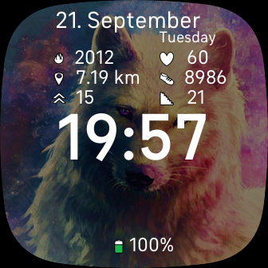
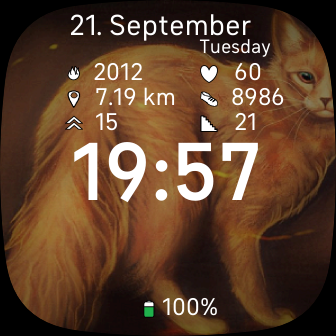

#  Images and Flags

<<<<<<< HEAD

=======
 
>>>>>>> 1c1b45d357b495c04366c7e9de86d3b25a2f093e

## Description

A clock face for Fitbit Sense and Versa 3. Built using the Fitbit Studio and Fitbit OS Simulator.

### Clock

- Supports both 12-hour and 24-hour format

### Stats

- Calories burn in kcal
- Distance in kilometers
- Active zone in minutes
- Heart rate in bpm
- Steps
- Floors
- Battery charge displayed at the bottom center (number)

### Color Schemes

- yellow => Cat (Maine coon)
- indigo => Dragon
- DarkGreen => Poppies
- Dark Blue => Space
- Gray => Wolf

